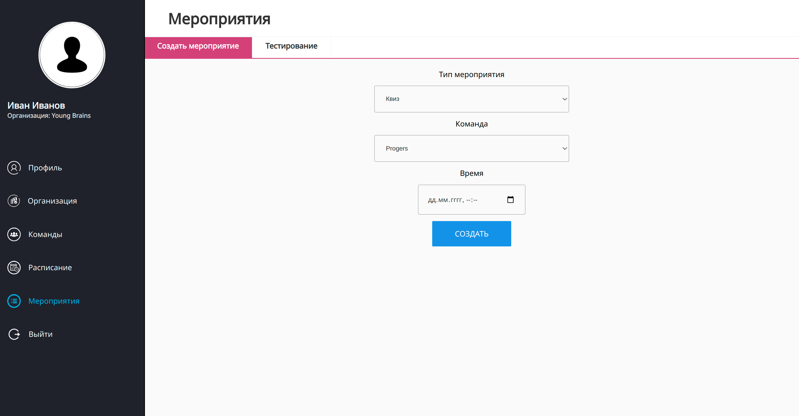
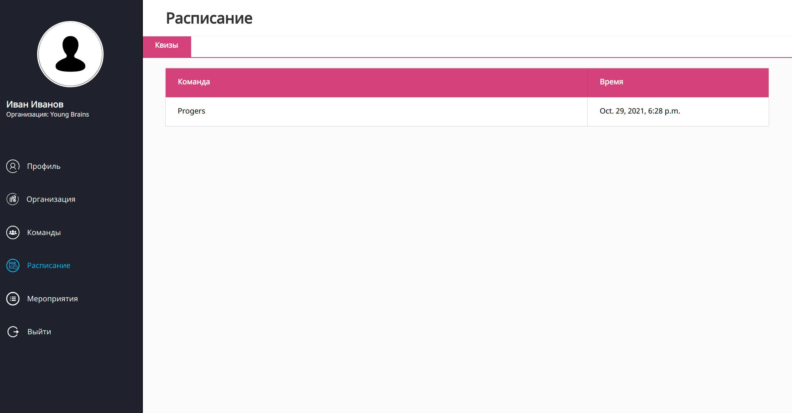
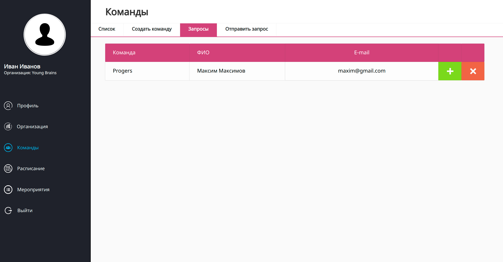
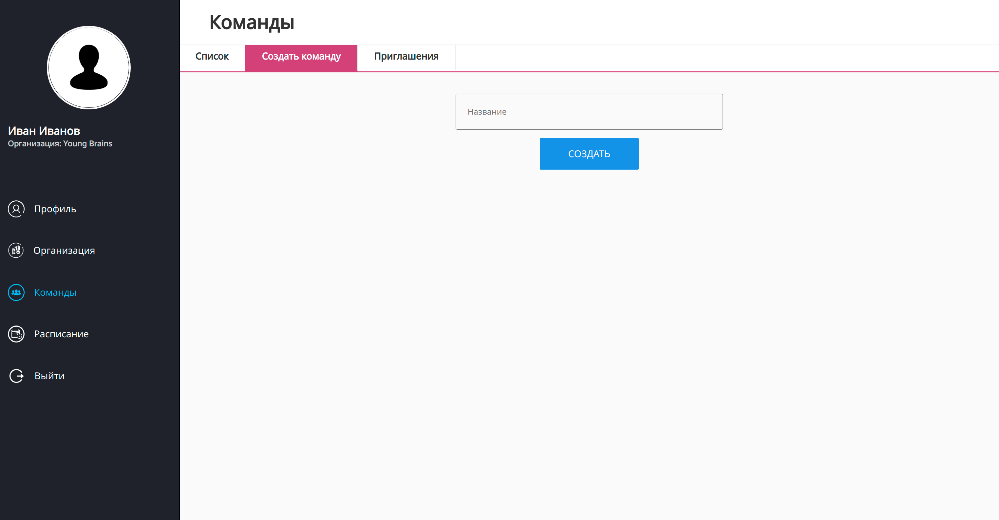
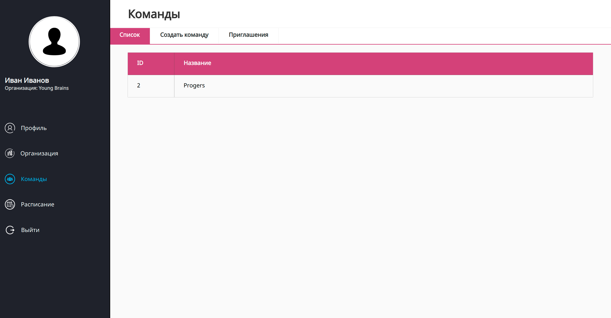

# Final

[Пример работы (ссылка на видео).](https://drive.google.com/file/d/1gZuI9GOcvbs4JOmqPvg-QoMpcu-9X50l/view?usp=sharing)

# Day 7 (24.10.2021)

- минимальная логика мероприятий и расписания (создание и отображения квиза в расписание);

# Day 6 (23.10.2021)

- доработка функционала работы с командой (отправка и подтверждения участия и т. д.);
- описание самого простого квиза:
  Квиз состоит из **n** (задается при создании) вопросов (QuizQuestion) рандомных из базы. В квизе участвует **k**
  команд (создатель квиза отправляет приглашения каждой, примает приглашение админ (создатель) команды). Перед началом
  квиза каждая команда выбирает капитана с помощью голосования. Рассматривается два формата участия в квизе (
  предполагается, что параллельно идет обсуждение с сокомадниками в обоих случаях):
    - каждый участник команды делает свой выбор, но окончательное решение за команду принимает капитан;
    - каждый участник команды выбирает ответ, который считает правильным, в качестве общего ответа берется тот, за
      который проголосовали больше людей.

  QuizQuestion имеет два типа: с заложенным правильным ответом и выбором лучшего из предложенных. Все вопросы в квизе
  имеют одинаковые веса. Побеждает команда с наибольшим кол-вом баллов.

  Данные, которые можно собрать и дальше обработать: степень расхождения ответа каждого участника с ответами сокомадниками, степень расхождения ответа капитана
  с командой, активность - кол-во вопрос, на которые участник отвечал.

# Day 5 (22.10.2021)

- обновление дизайна
- минимальный функционал с командами

# Day 4 (21.10.2021)

- суб. меню в профиле
- подтверждение и отклонение запросов

[Пример работы (это ссылка на видео).](https://drive.google.com/file/d/1rAFk_j2GYaenXBE6gnEmA3RT0z4AernU/view?usp=sharing)

# Day 3 (20.10.2021)

- минимальный личный кабинет
- создание компании и отправка запроса на подтверждение

[Пример работы (это ссылка на видео).](https://drive.google.com/file/d/1frp6ijluFZl8t2Gl6TunT-2FIcvdwzx1/view?usp=sharing)

# Day 2 (19.10.2021)

[Пример работы (это ссылка на видео).](https://drive.google.com/file/d/1PCnbUtR1rXLmXdZpZAGhekehxI1EEaVl/view?usp=sharing)

# Day 1 (18.10.2021)

## Описание и БД

Описание основных объектов (примерно, подлежит дальнейшей коррекции):

- Пользователи: могут находиться в трех состояниях (подключен к компании, не подключен к компании, находится в процессе
  ожидания подключения); планируемые возможности: работа с объектом Команда (создавать, входить, выходить),
  просматривать свое расписание мероприятий, отслеживать других членов Компании.

- Компания: у каждой Компании есть суперадмин и админы, которые обладают некоторыми преимуществами по сравнению с
  другими членами компании.

- Команда: привязан к объекту Компания, создают пользователи (любой член Компании), Команду можно записать на
  мероприятие (при этом записывается не только сам объект Команда, но и все ее члены Пользователи);

- Мероприятия: содержит ссылки на мероприятия (ссылки хранятся как “массивы” по типу)

- Мероприятие [type]: набор полей зависит от [type]

## Макеты

Страница компании:

Страница моя команда:

Страница создания команды:

Статистика команды:
 
