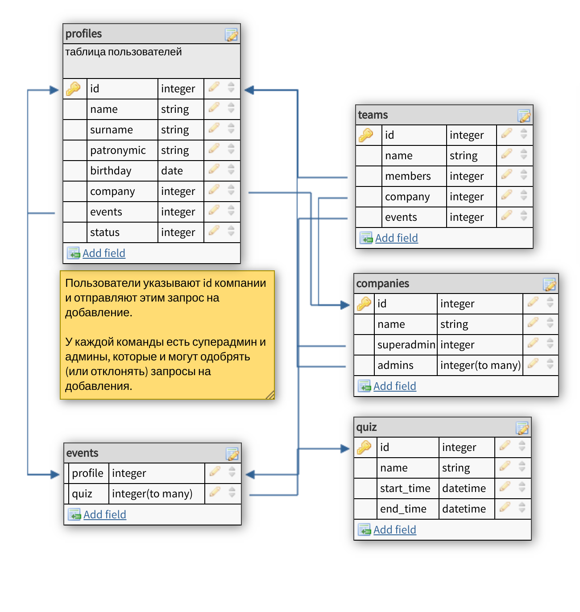
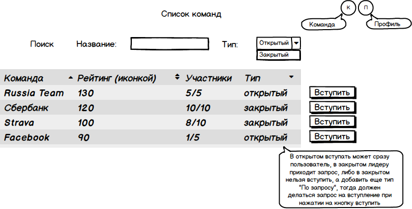
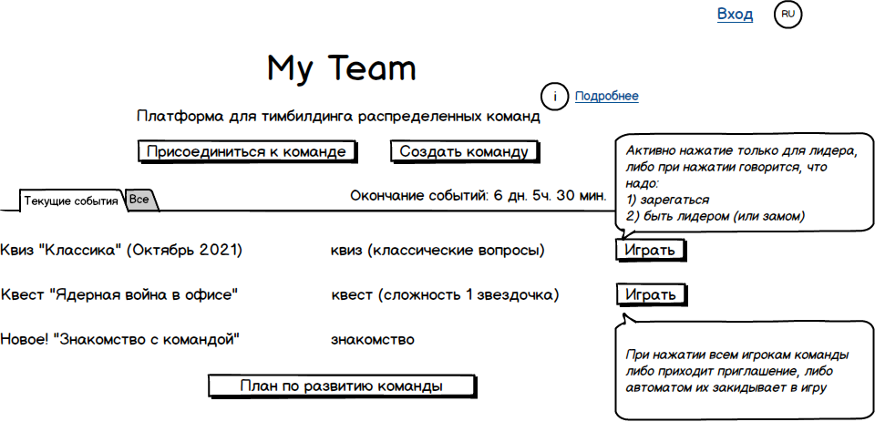
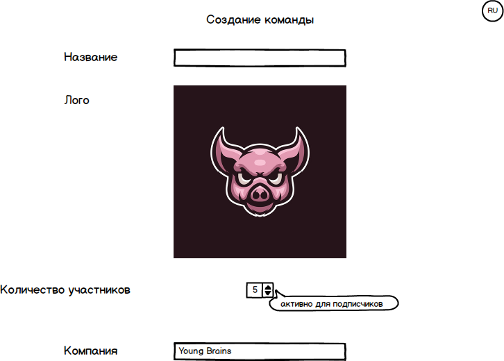
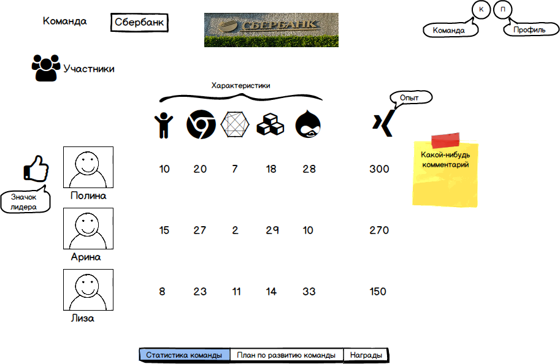

# Day 2 (19.10.2021)

[Пример работы (это ссылка на видео).](https://drive.google.com/file/d/1PCnbUtR1rXLmXdZpZAGhekehxI1EEaVl/view?usp=sharing)

# Day 1 (18.10.2021)

## Описание и БД

Описание основных объектов (примерно, подлежит дальнейшей коррекции): 
 
- Пользователи: могут находиться в трех состояниях (подключен к компании, не подключен к компании, находится в процессе ожидания подключения); планируемые возможности: работа с объектом Команда (создавать, входить, выходить), просматривать свое расписание мероприятий, отслеживать других членов Компании. 
 
- Компания: у каждой Компании есть суперадмин и админы, которые обладают некоторыми преимуществами по сравнению с другими членами компании. 
 
- Команда: привязан к объекту Компания, создают пользователи (любой член Компании), 
Команду можно записать на мероприятие (при этом записывается не только сам объект Команда, но и все ее члены Пользователи); 
 
- Мероприятия: содержит ссылки на мероприятия (ссылки хранятся как “массивы” по типу) 

- Мероприятие [type]: набор полей зависит от [type] 
 
 
 
## Макеты

Страница компании:
 
Страница моя команда:
 
Страница создания команды:
 
Статистика команды:
 